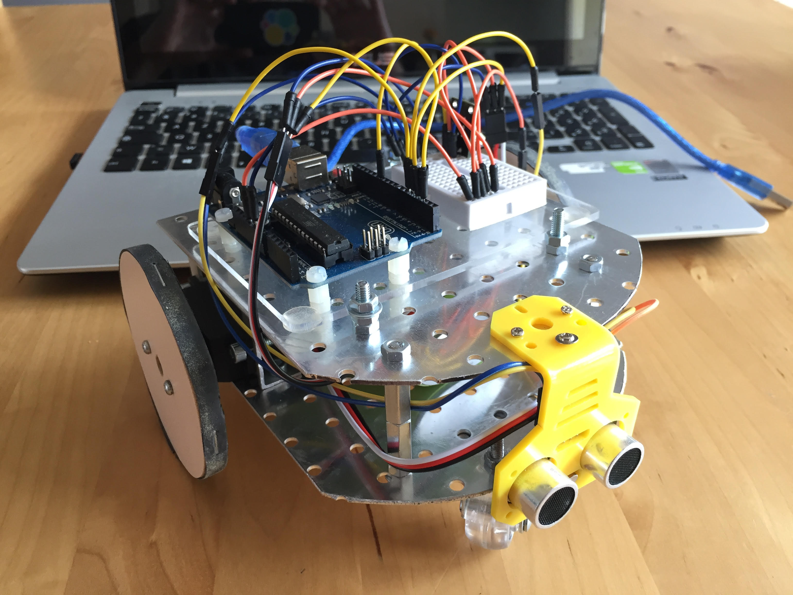
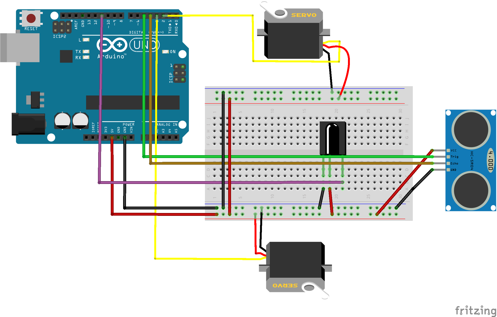

# arduino_alubot
Un robot commandé par arduino sur un châssis en aluminium.

Schéma de montage avec un Arduino UNO, 2 servo pour les roues, un capteur ultrason HC-SR04 et un récepteur infrarouge pour la télécommande (optionnelle) :

### Télécommande  
Dans cette version, le robot est démarré et arrêté par télécommande infra-rouge, mais cette partie du programme peut être supprimée.  
La gestion de la télécommande nécessite la bibliothèque suivante :  
`#include <IRremote.h>`  
Cette bibliothèque est à télécharger sur https://github.com/z3t0/Arduino-IRremote puis à dézipper dans le dossier d'installation du logiciel Arduino (en général C:\Program Files (x86)\Arduino\libraries\IRremote)

La version ultrason V1 stoppe à 20cm d'un objet recule et tourne à gauche puis repart en avant

La version ultrason V2 (inspirée de https://openclassrooms.com/courses/perfectionnez-vous-dans-la-programmation-arduino/faites-reagir-votre-robot-avec-des-capteurs) ralentit à partir de 50 cm. Stoppe à 10 puis tourne à gauche s'il n'y a pas d'obstable à moins de 50cm. Sinon tourne à droite lentement jusqu'à trouver un espace libre pour repartir.